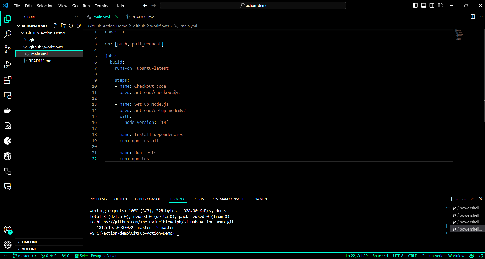
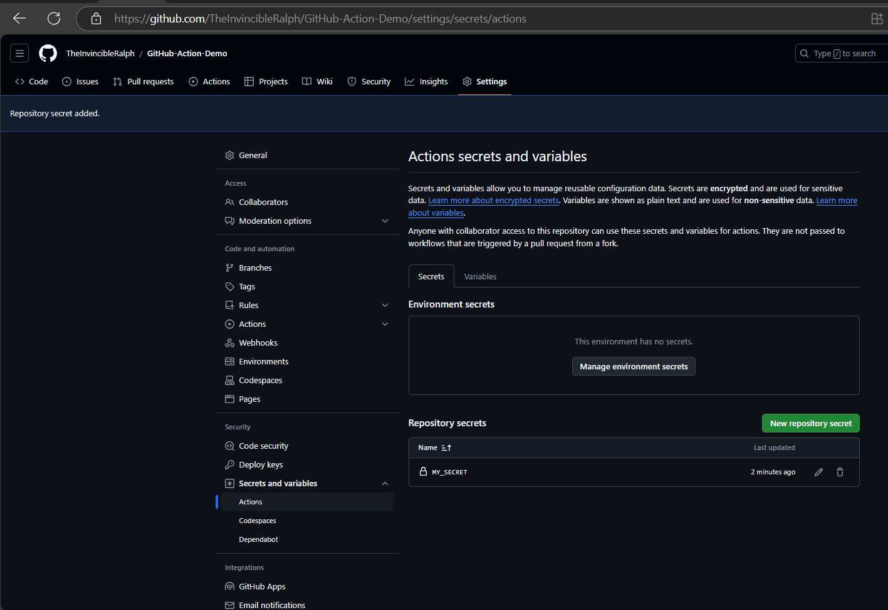
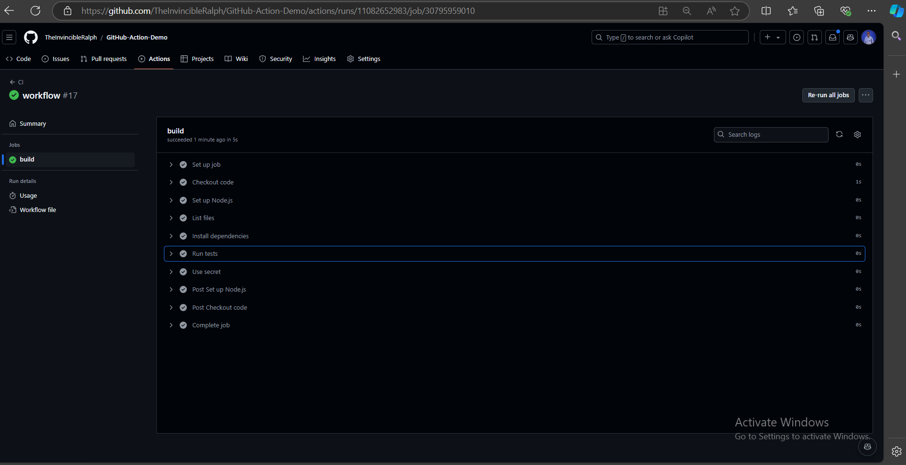

# GitHub Action Lab Guide


## Step 1: Create a New GitHub Repository
- Go to GitHub and create a new repository.
- Initialize the repository with a README.md file.
- Clone the repository to your local machine:
- git clone https://github.com/your-username/your-repo-name.git
- cd your-repo-name


## Step 2: Create a Workflow Directory
- Create a directory for your GitHub Actions workflows:
- mkdir -p .github/workflows


## Step 3: Create a Simple Workflow
- Create a new workflow file:
```bash
touch .github/workflows/main.yml
```
Open main.yml in your favorite text editor and add the following content to define a simple workflow:

```yaml
name: CI

on: [push, pull_request]

jobs:
  build:
    runs-on: ubuntu-latest

    steps:
    - name: Checkout code
      uses: actions/checkout@v2

    - name: Set up Node.js
      uses: actions/setup-node@v2
      with:
        node-version: '14'

    - name: Install dependencies
      run: npm install

    - name: Run tests
      run: npm test
```

Commit and push the workflow file to your repository:
- git add .github/workflows/main.yml
- git commit -m "Add initial GitHub Actions workflow"
- git push origin main



## Step 4: Trigger the Workflow
- Make a change to your repository and push it to trigger the workflow.
- Go to the "Actions" tab in your GitHub repository to see the running workflow.

## Step 5: Create a Workflow with Multiple Jobs
Open main.yml and modify it to include multiple jobs:

```yaml
name: CI

on: [push, pull_request]

jobs:
  build:
    runs-on: ubuntu-latest

    steps:
    - name: Checkout code
      uses: actions/checkout@v2

    - name: Set up Node.js
      uses: actions/setup-node@v2
      with:
        node-version: '14'

    - name: Install dependencies
      run: npm install

    - name: Run tests
      run: npm test

  lint:
    runs-on: ubuntu-latest

    steps:
    - name: Checkout code
      uses: actions/checkout@v2

    - name: Set up Node.js
      uses: actions/setup-node@v2
      with:
        node-version: '14'

    - name: Run linter
      run: npm run lint
```

Commit and push the changes to your repository:

- git add .github/workflows/main.yml
- git commit -m "Add lint job to GitHub Actions workflow"
- git push origin main

## Step 6: Use Secrets in Your Workflow
Go to the "Settings" tab in your GitHub repository.
Click on "Secrets" and then "New repository secret".
Add a new secret (e.g., MY_SECRET) with a value.



Modify main.yml to use the secret:

```yaml
name: CI

on: [push, pull_request]

jobs:
  build:
    runs-on: ubuntu-latest

    steps:
    - name: Checkout code
      uses: actions/checkout@v2

    - name: Set up Node.js
      uses: actions/setup-node@v2
      with:
        node-version: '14'

    - name: Install dependencies
      run: npm install

    - name: Run tests
      run: npm test

    - name: Use secret
      run: echo ${{ secrets.MY_SECRET }}
```
Commit and push the changes to your repository:
- git add .github/workflows/main.yml
- git commit -m "Use secret in GitHub Actions workflow"
- git push origin main

