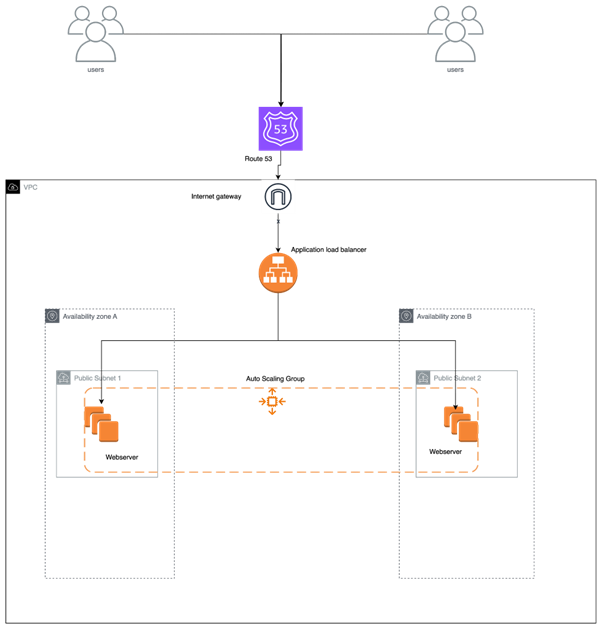
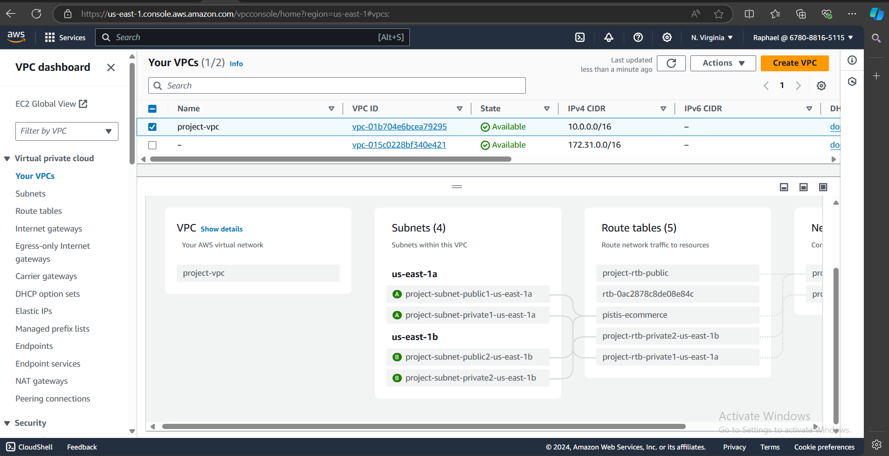
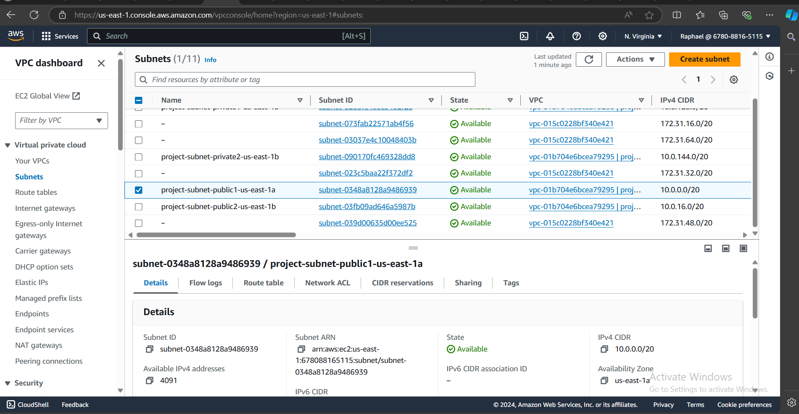
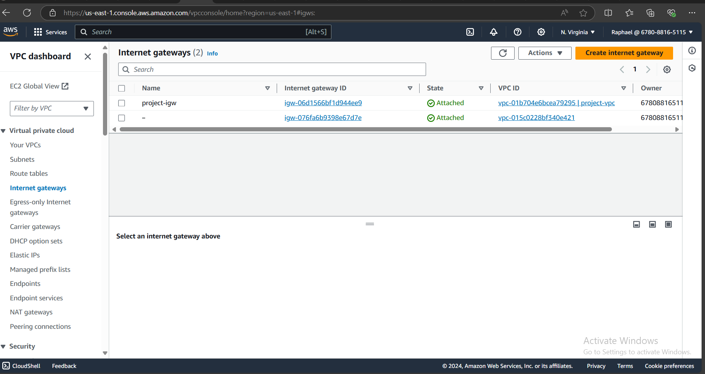
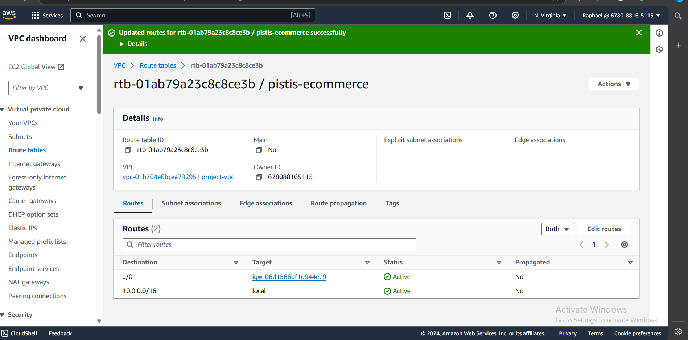
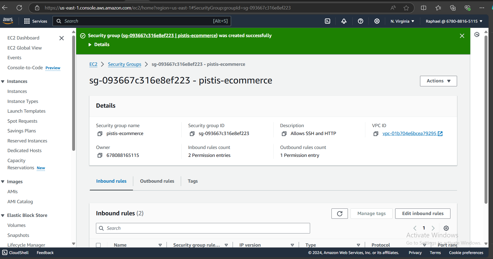
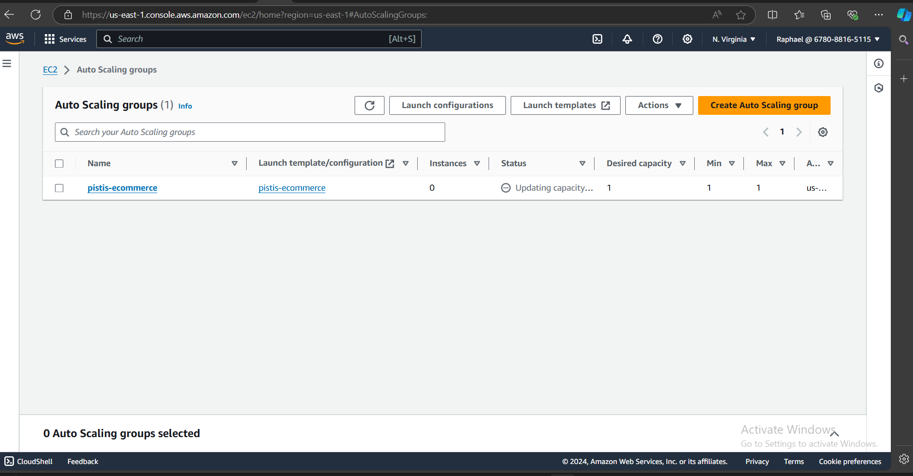

# Critical Thinking Project: Dynamic Scaling in AWS Auto Scaling

> Scenario: You are managing the infrastructure for an e-commerce website. During peak shopping hours, the website experiences a significant increase in traffic, leading to a strain on the server resources. To address this, you need to implement dynamic scaling using AWS Auto Scaling to ensure optimal performance and cost-effectiveness.



- Understand the given Architecture Diagram
- Create the infrastructure
- Ensure your infrastructure is split across multiple zones in a single region
- Deploy a simple Node.js Application to the infrastructure
- Load test the application
- Ensure the Auto-scaling group increases the instance when the CPU usage rises to 80%
- Ensure the Auto-scaling group increases the instance when the Memory usage rises to 80%
- Ensure the Auto-scaling group scales down when the load decreases
- Ensure you DELETE all your resources after you are done.

---

### Solution:

#### **Step 1: Set Up a VPC**
1. **Log into the AWS Management Console**: Open the [AWS Console](https://aws.amazon.com/console/) and log in.
2. **Go to VPC**:
   - Navigate to the **VPC** service.
   - Click **Create VPC**.
   - Choose **VPC only**.
   - Provide a **VPC name** and set the **IPv4 CIDR block** (e.g., `10.0.0.0/16`).
   - Click **Create VPC**.


   
#### **Step 2: Set Up Subnets**
1. **Create Subnets**:
   - Go to the **Subnets** section under the VPC service.
   - Create at least two **public subnets** in different **availability zones**.
     - Example: Subnet 1 (Availability Zone A, CIDR block `10.0.1.0/24`), Subnet 2 (Availability Zone B, CIDR block `10.0.2.0/24`).
   - Enable **Auto-assign public IPv4** for these subnets to ensure your EC2 instances get public IPs.



#### **Step 3: Set Up Internet Gateway**
1. **Create an Internet Gateway**:
   - Go to **Internet Gateways** in the VPC dashboard.
   - Click **Create Internet Gateway**, give it a name, and create it.
   - Attach this internet gateway to your VPC.



2. **Modify Route Tables**:
   - Go to the **Route Tables** section.
   - For the **main route table** associated with your VPC, create a new route.
   - Route: `0.0.0.0/0`, **Target**: Select the internet gateway you created.



#### **Step 4: Set Up Security Groups**
1. **Create Security Group**:
   - Go to **EC2** > **Security Groups**.
   - Create a security group and associate it with your VPC.
   - Allow inbound traffic:
     - **SSH** (port 22) for your IP address.
     - **HTTP** (port 80) from anywhere.



#### **Step 5: Launch EC2 Instances for Auto Scaling**
1. **Go to EC2** and click **Launch Template**.
2. **Create a Launch Template**:
   - Provide a **template name** and description.
   - **AMI**: Use the latest Amazon Linux or Ubuntu AMI.
   - **Instance Type**: Choose a type like `t2.micro` or `t3.micro` (depending on free tier eligibility or needs).
   - **Key Pair**: Select an existing key pair or create a new one for SSH access.
   - **Network Settings**: Choose the **subnet** you created, and attach the **security group**.
   - **Advanced Settings**: Under user data, you can deploy your Node.js application. This is a simple example of a Node.js app being installed:
     ```bash
     #!/bin/bash
     yum update -y
     curl -sL https://rpm.nodesource.com/setup_14.x | sudo bash -
     sudo yum install -y nodejs
     git clone https://github.com/your-repo/node-app.git /home/ec2-user/node-app
     cd /home/ec2-user/node-app
     npm install
     npm start
     ```
   - Click **Create Launch Template**.



#### **Step 6: Set Up Auto Scaling**
1. **Create an Auto Scaling Group**:
   - Go to **Auto Scaling Groups** and click **Create Auto Scaling Group**.
   - Choose the **launch template** you just created.
   - Set **desired capacity** to 1, **minimum** to 1, and **maximum** to 3 (or any number based on your expected traffic).
   - Choose the **VPC** and the **subnets** you created.
   - Configure **Health Check**: Select **EC2** for now.
   
2. **Configure Scaling Policies**:
   - Choose **Target Tracking Scaling** policy based on **CPU utilization**.
   - Set the scaling policy to increase instances when the **CPU utilization** exceeds 80%.
   
3. **Add a Memory-Based Scaling Policy**:
   - To scale based on memory usage, you’ll need a custom CloudWatch metric.
     - **Memory** isn't tracked by default, so use a script to push memory data to CloudWatch (see Step 8 for how to do this).
   - After that, add a similar policy in Auto Scaling for **Memory Utilization** at 80%.

#### **Step 7: Load Balancer (Optional but Recommended)**
1. **Create a Load Balancer**:
   - Go to **EC2** > **Load Balancers**.
   - Click **Create Load Balancer** and select **Application Load Balancer**.
   - Name your load balancer and select **internet-facing**.
   - Add listeners on port **80** for HTTP traffic.
   - Select the subnets from the VPC where your instances will run.
   - Create a new **target group** (which will register your EC2 instances dynamically).
   - Attach your **Auto Scaling group** to the load balancer.

#### **Step 8: Memory Utilization Monitoring**
To auto-scale based on memory utilization (which isn’t tracked by CloudWatch by default), you need to install the **CloudWatch Agent** on your EC2 instances.

1. **Install CloudWatch Agent**:
   Add this to your **Launch Template** user data, after installing Node.js:
   ```bash
   sudo yum install amazon-cloudwatch-agent -y
   sudo /opt/aws/amazon-cloudwatch-agent/bin/amazon-cloudwatch-agent-config-wizard
   ```
   
2. **Configure CloudWatch Agent**:
   Create a configuration file for CloudWatch Agent to monitor memory:
   ```json
   {
       "metrics": {
           "append_dimensions": {
               "AutoScalingGroupName": "${aws:AutoScalingGroupName}"
           },
           "metrics_collected": {
               "mem": {
                   "measurement": [
                       "mem_used_percent"
                   ],
                   "metrics_collection_interval": 60
               }
           }
       }
   }
   ```
   Add this in the **user data** script:
   ```bash
   sudo /opt/aws/amazon-cloudwatch-agent/bin/amazon-cloudwatch-agent-ctl -a fetch-config -m ec2 -c file:/home/ec2-user/cloudwatch-config.json -s
   ```

3. **Set Up a Custom Alarm for Memory**:
   - Go to **CloudWatch** and create a **custom alarm** for memory usage, with a threshold of 80%.
   - Attach this alarm to your **Auto Scaling group**.

#### **Step 9: Load Testing the Application**
1. **Test Load**:
   Use a tool like **Apache JMeter** or **Artillery** to simulate load on your application.
   - Ensure the Auto Scaling group spins up new instances when the CPU or memory usage exceeds the 80% threshold.
   
#### **Step 10: Cleaning Up**
1. **Delete Resources**:
   - Once testing is complete, ensure you delete all resources (EC2 instances, Auto Scaling groups, load balancers, VPCs, subnets, etc.) to avoid unnecessary charges.
   - Delete the stack or manually delete individual resources through the AWS Console.

---
