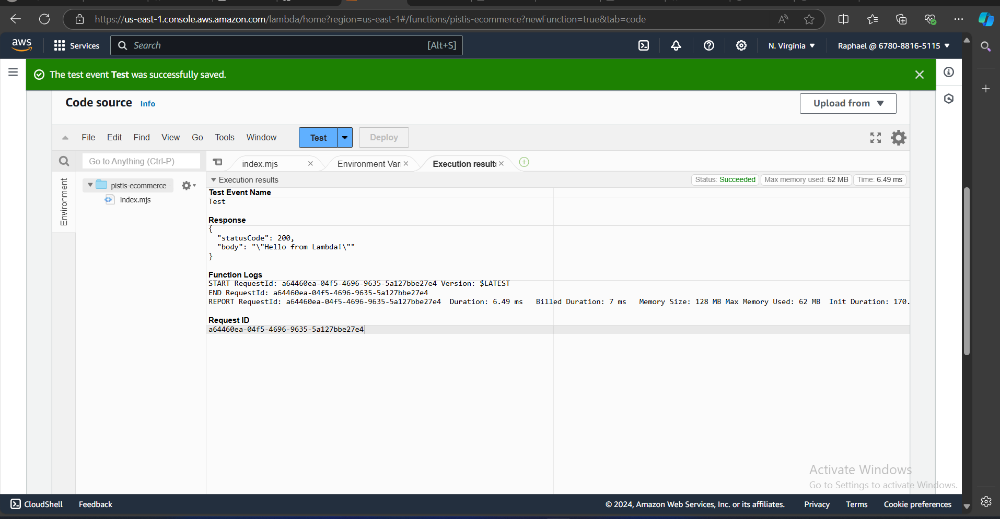

# DEPLOYMENT ANALYSIS: Deploying a Static Website on AWS Lambda and AWS Elastic Beanstalk

## Deployment on AWS Lambda

### **1. Obtain a Static Website Template**
To simulate a typical e-commerce website:
- Search for and download a static website template or sample that includes **HTML, CSS, and JavaScript**. You can find templates on sites like [HTML5 UP](https://html5up.net/) or [ThemeForest](https://themeforest.net/).
- This will serve as your "application" for deployment.

### **2. Set Up AWS Account**
If you don't have an AWS account, create one at [aws.amazon.com](https://aws.amazon.com/). You may use the free tier, but ensure you keep track of costs.

### **3. Deploy the Website on AWS Lambda with Amazon S3**
AWS Lambda is suitable for serverless applications. For this, we will deploy the static website to **Amazon S3** and use **AWS Lambda** to handle dynamic backend functions (if needed).

#### **Step 1: Set Up an S3 Bucket**
- **Create an S3 bucket** to store your static website:
  1. Go to the **S3 console** in AWS.
  2. Click "Create Bucket" and give it a unique name.
  3. Disable **Block all public access** to allow web access (configure permissions carefully).
  4. Upload the **HTML, CSS, and JS** files into the bucket.
  5. Go to **Properties**, select **Static website hosting**, and enable it. Configure the index and error documents (e.g., `index.html` and `error.html`).
  6. Take note of the **S3 URL**, as it will serve your static website.

  

#### **Step 2: Configure AWS Lambda**
- **Create a Lambda function** if your website requires backend logic:
  1. Go to the **Lambda console**.
  2. Click "Create Function" and choose "Author from scratch."
  3. Choose a **runtime** (Node.js, Python, etc.), and create the function.
  4. Use API Gateway to expose your Lambda function as an HTTP endpoint.
  5. If needed, you can use the Lambda function to interact with databases (DynamoDB, RDS, etc.).

---

---

#### **Step 3: Configure Amazon CloudFront (Optional but necessary for Performance)**
- Use **Amazon CloudFront** to distribute the static website globally for faster loading times.
  1. Go to the **CloudFront console**.
  2. Click "Create Distribution."
  3. Set the **S3 bucket** as the origin, and customize the cache settings for optimal performance.
  
### **5. Deploy the Website on AWS Elastic Beanstalk**
AWS Elastic Beanstalk is a Platform-as-a-Service (PaaS) that can deploy web applications in environments like Node.js, Python, PHP, etc.

#### **Step 1: Set Up Elastic Beanstalk**
- **Create an Elastic Beanstalk application** to host your website:
  1. Go to the **Elastic Beanstalk console**.
  2. Click "Create Application" and provide a name.
  3. For **Platform**, select **Node.js**, **PHP**, or another platform that matches your web stack.
  4. Upload your static website files as a zip file, or use a sample application.
  5. Click "Create Environment," and Elastic Beanstalk will provision the resources (EC2 instances, Auto Scaling, Load Balancers) for you.

#### **Step 2: Configure Elastic Beanstalk**
- After deployment, you can customize the environment by configuring:
  - **Instance types** (under **Configuration**).
  - **Scaling settings** (Auto Scaling to handle traffic spikes).
  - **Load Balancer** (to distribute traffic).

#### **Step 3: Access the Website**
- Once deployed, Elastic Beanstalk provides a public URL for your website. Test the deployment by visiting the URL.

### **6. Application to Infrastructure**
- Use **Elastic Load Balancing** in Elastic Beanstalk for high availability.
- For Lambda, integrate **API Gateway** to expose dynamic functions as REST APIs.
- Enable **logging** with AWS CloudWatch for monitoring both platforms.

### **7. Performance and Scalability Comparison**
#### **Performance Testing:**
- Use tools like **AWS CloudWatch**, **AWS X-Ray**, and third-party services like **GTmetrix** or **Pingdom** to monitor the performance of both Lambda and Elastic Beanstalk.
- Track metrics like:
  - Response time
  - Throughput
  - Error rates
  - Resource utilization (Lambda duration vs EC2 instance usage in Beanstalk)
  
#### **Scalability Testing:**
- Perform a **load test** using AWS services (e.g., **AWS Load Testing Solution** or **Apache JMeter**) to simulate heavy traffic.
- Measure the elasticity of both Lambda (automatic scaling based on requests) and Elastic Beanstalk (EC2 Auto Scaling groups).

### **8. Cost Analysis**
Use **AWS Pricing Calculator** to estimate and compare costs. Key differences:
- **AWS Lambda**: Billed based on the number of requests and execution duration.
- **Elastic Beanstalk**: Costs are based on the underlying resources (EC2 instances, storage, bandwidth, etc.).
  
Factors to consider:
- Lambda is **serverless** and **pay-per-use**, making it potentially more cost-efficient for small workloads.
- Elastic Beanstalk is good for more complex, stateful applications with persistent server needs.

### **9. Clean Up Resources**
Once the project is complete, **delete all AWS resources** to avoid unexpected charges:
- Delete **S3 buckets**, **CloudFront distributions**, **Lambda functions**, and **Elastic Beanstalk environments**.
- Terminate **EC2 instances** and clean up any databases or other associated resources.

### **10. Present Findings**
Prepare a report that includes:
- Performance metrics for both AWS Lambda and Elastic Beanstalk deployments.
- Cost breakdown and recommendations on which platform suits the startup's needs based on the traffic, performance, and expected growth.