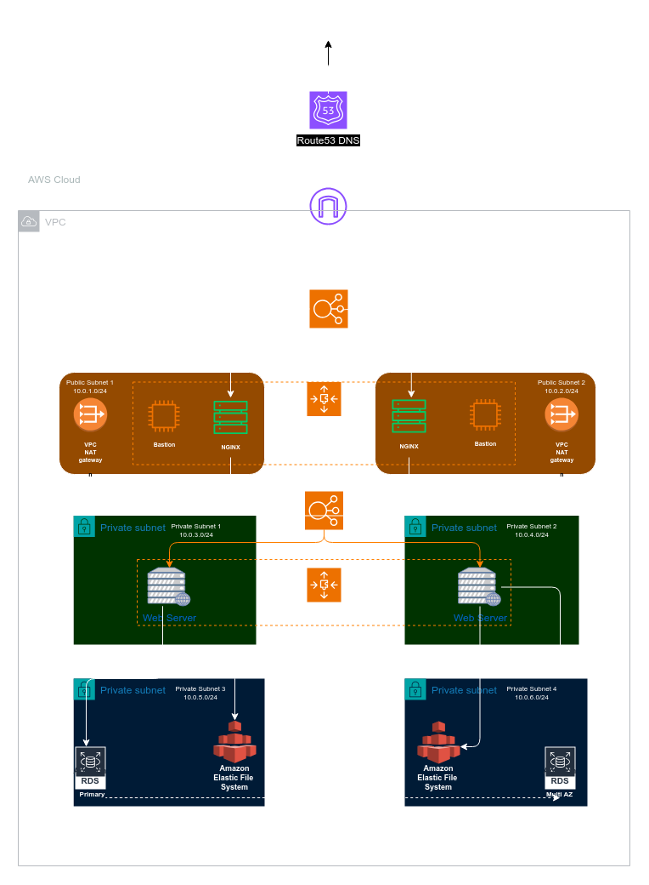

## Task:

> *You are part of a team charged with migrating two company websites to the AWS cloud infrastructure. The first website is an e-commerce platform managing sensitive customer information, while the second website is a content management system (CMS) used for publishing articles and blogs. Both websites demand robust security protocols, scalable architecture to handle varying traffic loads, and efficient resource management to minimize costs. How can you employ reverse proxy technology within the AWS environment to meet these requirements effectively for each website while optimizing their performance and security?*

---

## Solution:

To migrate both websites to AWS while addressing security, scalability, and cost-efficiency, we can employ **reverse proxy technology** using **Amazon Elastic Load Balancer (ELB)** and **Nginx** as key components.

### 1. **E-commerce Platform (Website 1)**
   - **Security**: 
     - Use **AWS Application Load Balancer (ALB)** as a reverse proxy to route HTTPS traffic securely to backend instances (EC2 in private subnets). Enforce **SSL termination** at ALB to protect sensitive customer data.
     - **AWS Web Application Firewall (WAF)** integrated with ALB to defend against threats like SQL injection and cross-site scripting (XSS).
   - **Scalability**: 
     - ALB automatically distributes traffic across **EC2 instances** in **Auto Scaling Groups**, ensuring dynamic scaling based on demand.
   - **Cost-efficiency**: 
     - Use **AWS Elastic File System (EFS)** for shared storage and **RDS** for managed databases, reducing administrative overhead.
     - Use **NAT Gateway** for secure outbound traffic to fetch updates or external services.

### 2. **CMS Platform (Website 2)**
   - **Security**:
     - Employ **ALB** with SSL termination for secure inbound traffic. Use **CloudFront** as a content delivery network (CDN) in front of ALB for caching and DDoS protection.
   - **Scalability**:
     - Use **Auto Scaling** for backend EC2 instances, scaling resources based on CMS traffic patterns.
   - **Cost-efficiency**:
     - Integrate **S3** for static content storage and delivery through CloudFront, minimizing compute costs.
     - Utilize **EC2 Spot Instances** for non-critical workloads, optimizing costs.

### Reverse Proxy Optimization:
   - Both websites can use **Nginx** as a reverse proxy on EC2 instances for **caching, load balancing**, and **rate-limiting** before forwarding traffic to the backend, further optimizing performance and security while maintaining control over traffic management.

---

## Analysis of a Reverse Proxy Infrastructure

This AWS architecture diagram shows a multi-tier setup designed to ensure security, scalability, and redundancy for two company websites. Here's a detailed explanation of each component:

---

### **1. Route 53 DNS:**
- **Route 53** is the AWS **DNS service** used to route traffic to the application. It will resolve domain names for both websites and direct requests to the correct infrastructure, ensuring traffic is routed efficiently and securely.

---

### **2. VPC (Virtual Private Cloud):**
- The entire architecture resides inside an **AWS VPC**, which isolates resources and enables secure communication within the infrastructure.
- **Subnets** are split between **Public** and **Private** subnets:
  - **Public Subnets**: For resources that need direct access to the internet (e.g., bastion hosts, NGINX servers).
  - **Private Subnets**: For backend services like web servers and databases, which are not exposed to the public internet.

---

### **3. NAT Gateways:**
- `The **NAT Gateway** in each public subnet allows instances in private subnets to access the internet (e.g., for software updates) without exposing them to incoming public traffic. This is an important security mechanism.`

---

### **4. Public Subnets (1 & 2):**
- **Bastion Hosts**: `These are EC2 instances located in the public subnets to enable secure SSH access to instances in private subnets`. The bastion host acts as a jump server, ensuring secure access to the private network without exposing private instances directly to the internet.
  
- **NGINX Servers**: 
  - **NGINX** is deployed in the public subnets as a **reverse proxy** to route incoming traffic to the appropriate backend servers (web servers in private subnets).
  - It helps with **load balancing**, **SSL termination**, and possibly **caching** to improve performance and security.
  - These NGINX servers forward requests to the backend web servers, and they distribute traffic between the two company websites.

---

### **5. Private Subnets (1 & 2):**
- **Web Servers**: The web servers are hosted in these private subnets and are responsible for serving the web application content.
  - These servers are isolated from the public internet, which enhances security.
  - Traffic from the NGINX servers in the public subnets is directed to these private web servers for processing requests.
  - These web servers could be configured to scale horizontally using **Auto Scaling** for handling increased traffic.

---

### **6. Private Subnets (3 & 4):**
- **Amazon RDS (Relational Database Service)**:
  - **Primary Database** in one subnet and a **Multi-AZ (Availability Zone) secondary database** in another subnet.
  - This ensures high availability and failover capabilities.
  - RDS is fully managed and automatically handles backups, patching, and scaling.
  - Databases are isolated in private subnets for security purposes.

- **Amazon Elastic File System (EFS)**: 
  - `EFS provides shared storage for the web servers.`
  - It is highly scalable and distributed across multiple Availability Zones, which means it can be accessed from multiple web servers simultaneously.
  - EFS is ideal for shared data or persistent storage that needs to be accessed by multiple web servers in different subnets.

---

### **7. Load Balancer (Central Component):**
- The central load balancer (possibly an **Application Load Balancer**) distributes incoming traffic across multiple **NGINX reverse proxies** in the public subnets. This load balancer improves scalability and performance by evenly distributing traffic across the NGINX instances.
- The load balancer likely routes traffic to the appropriate NGINX server based on domain name (e.g., for two different websites), and these NGINX servers, in turn, forward requests to the backend web servers.

---

### **Key Features of the Architecture:**

1. **Security**:
   - Resources are segmented into public and private subnets.
   - **NAT gateways** allow secure internet access for private instances.
   - **Bastion hosts** provide secure access to private resources.
   - **Web servers and databases** are hosted in private subnets, away from direct internet exposure.

2. **Scalability**:
   - **NGINX reverse proxies** and web servers can scale horizontally to handle varying traffic loads.
   - **Elastic File System (EFS)** provides scalable and shared storage across multiple web servers.
   - **RDS Multi-AZ** ensures the database layer is highly available and can handle failovers.

3. **Performance**:
   - **NGINX** improves performance by handling SSL termination, load balancing, and caching.
   - **EFS** ensures fast, scalable, and consistent storage for web servers.
   - **RDS** automatically scales based on the application’s demands.

4. **Redundancy and High Availability**:
   - The architecture spans multiple **Availability Zones (AZs)** within AWS, ensuring fault tolerance.
   - The RDS setup includes **Multi-AZ** for database redundancy.
   - **Auto Scaling** ensures that web and NGINX servers automatically adjust to demand.

5. **Cost Efficiency**:
   - By using **NGINX** for SSL offloading, load balancing, and reverse proxying, the architecture reduces the load on web servers.
   - Resources like EFS, RDS, and Auto Scaling dynamically adjust usage based on traffic and demand, optimizing cost.

---

