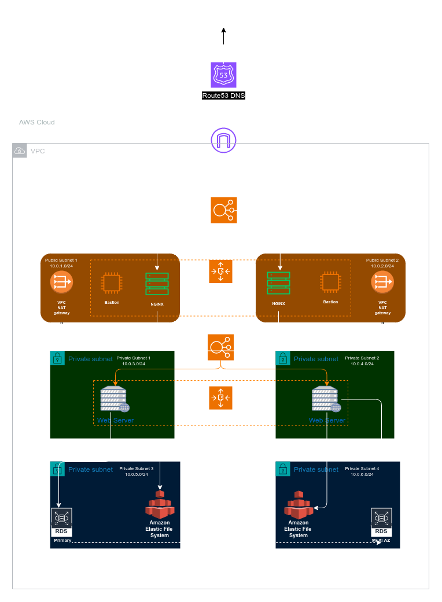

# Analysis of a Reverse Proxy Infrastructure

## NAT Gateway and Bation Hosts: Meaning and Use Cases

### NAT Gateways

A **NAT Gateway** (Network Address Translation Gateway) acts as an intermediary between instances in a **private subnet** and the internet. Its primary role is to enable outbound communication from private instances while preventing inbound connections from the internet. Here's how it operates:

---

### **1. Instance in Private Subnet Wants to Access the Internet:**

- Instances (e.g., web servers, databases) that reside in private subnets (which are not directly routable from the internet) may still need access to the internet for tasks such as:
  - Downloading patches and updates.
  - Communicating with external APIs.
  - Uploading data to cloud storage or third-party services.
  
- However, these instances are deliberately placed in private subnets to **enhance security** and prevent direct inbound traffic from the internet.

---

### **2. NAT Gateway as an Intermediary:**

- The **NAT Gateway** resides in a **public subnet** within the same **VPC** as the private instances.
- The NAT Gateway has both:
  - **Private IP Address**: For communication with private instances within the VPC.
  - **Public IP Address** (Elastic IP): For communication with the internet.
  
- The NAT Gateway translates the **private IP addresses** of outgoing requests from the instances in the private subnet to its **public IP address**. This allows the outbound traffic to appear as if it's coming from the NAT Gateway itself rather than the private instance.

---

### **3. Outbound Request Flow:**

- When an instance in a private subnet needs to reach the internet, the request is routed through the NAT Gateway.
- Here's how the flow happens:
  1. **Private instance initiates an outbound request** (e.g., to download an update).
  2. The request is sent to the **NAT Gateway** via the **VPC routing table** (which has a route entry pointing to the NAT Gateway for internet-bound traffic).
  3. The **NAT Gateway translates** the **source private IP** of the instance into the **public IP** of the NAT Gateway.
  4. The **request is sent out to the internet**.

---

### **4. Inbound Response Flow:**

- When the internet service (e.g., a software update server) responds, the response is sent back to the **public IP of the NAT Gateway**.
- The **NAT Gateway maps the response** back to the originating private instance by referencing the translation table that it maintains for each connection.
- The **response is forwarded to the instance** in the private subnet via its **private IP address**.

---

### **5. Key Security Features:**

- **No Inbound Traffic**: Even though private instances can send traffic out to the internet, no inbound traffic from the internet can reach the private subnet directly. *The NAT Gateway only allows established outbound connections to receive inbound responses*. Unsolicited inbound connections are automatically blocked.
  
- **Isolation**: Since the instances in the private subnet don’t have public IPs, they are completely shielded from direct access by malicious actors or external entities. This ensures they can only be accessed via trusted and secure internal methods like a **Bastion host** or **VPN**.

---

### **6. Routing Table Configuration:**

- To make the NAT Gateway work, the routing tables for private subnets must be configured properly:
  - The **private subnets' routing table** should include a route for internet-bound traffic (`0.0.0.0/0`) that points to the NAT Gateway.
  - The **public subnets' routing table** should direct internet-bound traffic to the **Internet Gateway** (which is separate from the NAT Gateway).

---

### **How This Enhances Security, Scalability, and Performance:**

1. **Security**:
   - The private instances can reach the internet for outbound requests, but they are not exposed to inbound traffic, reducing attack surface.
   - By using the NAT Gateway, instances in private subnets can securely access the internet for updates or external services without being directly accessible from outside.

2. **Scalability**:
   - The NAT Gateway is a fully managed AWS service that automatically scales to handle high levels of traffic. This means there’s no need for manual intervention or complex load balancing for outbound traffic.
   - As the number of private instances grows, the NAT Gateway can continue to route traffic without performance degradation.

3. **Performance**:
   - Since the NAT Gateway is managed and scaled by AWS, it ensures low-latency and high-throughput for instances needing access to external resources.
   - The efficiency of the translation process is maintained even under heavy load, ensuring that private instances can communicate with the internet without delays.
---

> In short, NAT Gateway gives instances in a private subnet a *public access interface*

---

### Why is the **NAT Gateway** Placed in the Public Subnet?

The **NAT Gateway** (Network Address Translation Gateway) is placed in a **public subnet** for the following reasons:

1. **Need for Internet Connectivity:**
   - A **public subnet** is a subnet that has access to the internet because its routing table includes a route to the **Internet Gateway**. Since the NAT Gateway needs to translate private IP addresses to public IP addresses for outbound internet requests, it must reside in a subnet that has direct internet access.
   - If the NAT Gateway were placed in a **private subnet**, it wouldn't be able to communicate with the internet because private subnets do not have routes to the Internet Gateway.

2. **Outbound Communication Only:**
   - The NAT Gateway facilitates **outbound internet communication** from instances in private subnets. It does not allow unsolicited inbound traffic from the internet to reach those instances. This ensures that private instances remain secure while still being able to make outbound requests.
   - Placing the NAT Gateway in the public subnet allows it to forward internet-bound traffic from private subnets to the outside world and relay responses back to the private instances.

3. **Security Considerations:**
   - The NAT Gateway is designed to block inbound traffic while allowing outbound traffic to pass through. Therefore, even though it is placed in a public subnet, it maintains a high level of security by not allowing incoming connections initiated from the internet. This ensures that private instances remain inaccessible from the outside.

---

### **Bastion Host**?

A **Bastion Host** (also called a jump box) is a **secure, hardened server** that is used to provide access to instances in a **private subnet** that do not have direct internet access. 

#### Key Features of a Bastion Host:
1. **Publicly Accessible**:
   - Unlike instances in private subnets, the bastion host is placed in a **public subnet** with an associated **public IP address**. This allows administrators or developers to connect to it from the internet, usually via **SSH (Secure Shell)** or **RDP (Remote Desktop Protocol)**.

2. **Acts as a Jump Box**:
   - The bastion host acts as an intermediary between the user and the instances in the private subnet. Once you log into the bastion host, you can **SSH or RDP** into private instances using their **private IP addresses**.
   - This design keeps the instances in the private subnet isolated from direct public access while still allowing authorized users to manage or maintain them securely.

3. **Enhanced Security**:
   - A bastion host is typically heavily hardened:
     - Minimal software installed to reduce attack vectors.
     - Strict firewall rules (only allowing connections from specific IPs).
     - Multi-factor authentication (MFA) for enhanced security.
     - Encrypted SSH keys for access.
   - The bastion host is **closely monitored**, and access to it is tightly controlled to minimize the risk of a security breach.

4. **Purpose**:
   - Private instances cannot have direct inbound internet access because of their placement in the private subnet. However, administrators often need to manage or debug these instances.
   - The bastion host provides a secure, controlled gateway for these management tasks without exposing the private instances to the internet directly.

#### Typical Workflow Using a Bastion Host:
- You want to manage an instance in a private subnet.
- First, **SSH into the bastion host**, which is publicly accessible.
- Once inside the bastion host, use **SSH or RDP** to access the private instances. Since the bastion is inside the VPC, it can communicate directly with the private instances using their private IP addresses.
  

---

### Diagram Integration:
In the context of the reverse-proxy architecture:

- **NAT Gateway** (in the public subnet) enables instances in the private subnet to make **outbound requests** to the internet.
- **Bastion Host** (also in the public subnet) provides secure, **restricted access** to instances in the private subnet for management purposes.