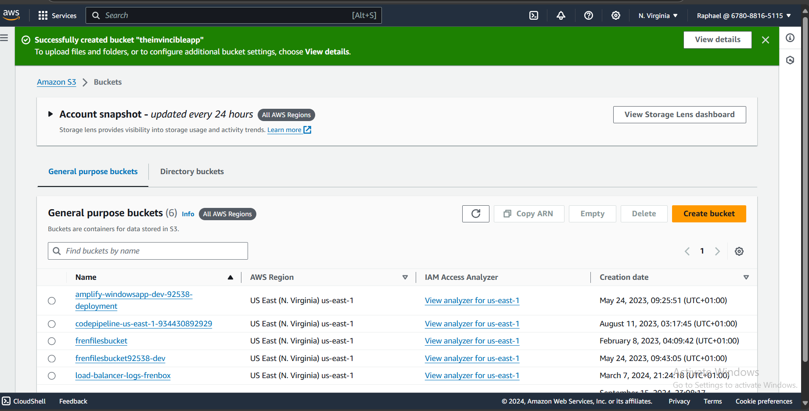
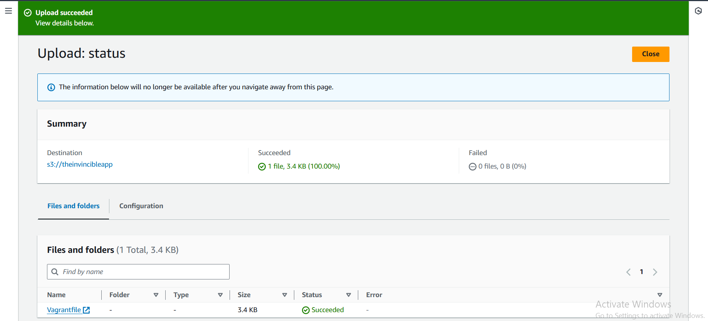
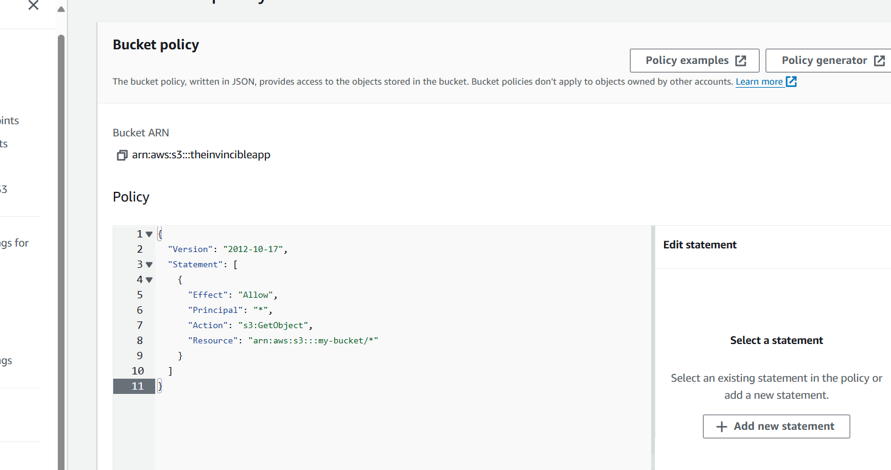

## Task:
> *As a junior DevOps engineer, explain how you would host a static website in an Amazon S3 bucket. Describe the steps in configuring the S3 bucket for website hosting, uploading the static website files, setting permissions, and enabling static website hosting. Additionally, discuss any considerations for domain configuration and CDN integration to enhance website performance. After proper research, provide an architectural diagram and host a sample static website in an Amazon S3 Bucket following the solutions and steps you have come up with.*

---

## Solution:

To host a static website in an Amazon S3 bucket as a junior DevOps engineer, I would follow these steps:

### Steps for Hosting a Static Website in an Amazon S3 Bucket:

1. **Create an S3 Bucket**:
To create an S3 bucket:
   - I would navigate to the AWS Management Console, go to the S3 service, and click on "Create bucket."
   - I would name the bucket and select the region closest to my target audience for faster content delivery or minimal latency.
   - I would ensure the bucket name matches my desired domain name in case of a custom domain.

2. **Configure the S3 Bucket for Website Hosting**:
To configure an S3 bucket:
   - I would navigate to the S3 bucket settings, and go to the "Properties" tab.
   - I would scroll down to "Static website hosting" and click on "Edit."
   - I would choose "Use this bucket to host a website," set the index document (e.g., `index.html`) and optionally an error document (e.g., `404.html`).
   - Then finally save the changes.

3. **Upload the Static Website Files**:
   - I would then upload my static website files (HTML, CSS, JS, images) by selecting "Upload" in the S3 bucket.
   - And Ensure all files are correctly placed in the root or organized in directories based on my  website’s structure.

4. **Set Permissions for the S3 Bucket**:
   - For public access to the website, I would go to the "Permissions" tab in the bucket settings, and the disable the "Block all public access" option.
   - In the bucket policy section, I would add a policy that allows public read access to the objects in the bucket:
     ```json
     {
       "Version": "2012-10-17",
       "Statement": [
         {
           "Effect": "Allow",
           "Principal": "*",
           "Action": "s3:GetObject",
           "Resource": "arn:aws:s3:::my-bucket/*"
         }
       ]
     }
     ```

5. **Test the Website**:
   - Once permissions are set, I would navigate to the "Static website hosting" section again, where my endpoint URL is (e.g., `http://my-bucket.s3-us-east-1.amazonaws.com`) and open the URL in a browser to verify that the website is working correctly.

### CDN Integration for Performance:
- To enhance performance, I would integrate **Amazon CloudFront** (AWS's Content Delivery Network):

---

### Architectural Diagram


---

### Implementation

**Bucket Creation**


**Static File**


**Bucket Policy**


