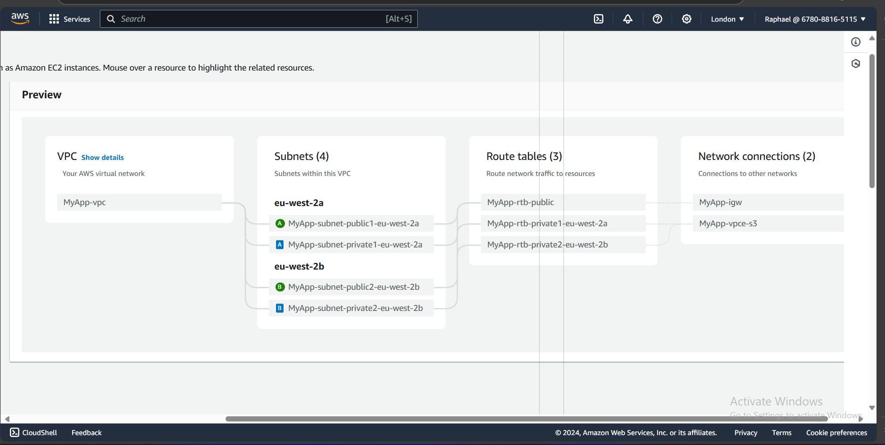

## Task:
> *As a senior DevOps engineer, you are tasked with designing a solution to ensure users in two different geographical locations, India and London, have a good browsing experience with minimal latency. Create an infrastructure solution that optimizes performance and minimizes latency for users in both regions. Consider factors such as content delivery networks (CDNs), edge caching, global load balancing, and region-specific deployment strategies to achieve this goal effectively. After designing the solutions (use draw.io), implement them and create the infrastructure in your AWS console.*

---

## Solution:

To design a solution that ensures users in India and London have an optimal browsing experience with minimal latency, here is a list of services that will be needed and the role of each service:

### 1. **Multiple AWS `Regions`**
   - **AWS Regions**: The application will be deployed in two AWS regions: one in **Mumbai (ap-south-1)** for India, and another in **London (eu-west-2)** for UK-based traffic. Hosting the infrastructure closer to the users in each geographic location will significantly reduce latency.

### 2. **Global Load Balancing with `Amazon Route 53`**
   - **DNS-based traffic routing**: Using **Amazon Route 53** with a **latency-based routing policy** to route traffic to the region with the lowest latency for the user. This ensures that users from India access the application in Mumbai, while users from London connect to the London region.
   - **Health checks**: Route 53 will monitor the health of the services in each region, and in case of a failure, it can redirect traffic to the other healthy region, providing failover.

### 3. **Content Delivery Network (CDN) with `Amazon CloudFront`**
   - **Edge caching with CloudFront**: Setting up **Amazon CloudFront**, which acts as a CDN that caches content at **edge locations** closer to users. This will ensure static and dynamic content is served with low latency. CloudFront will cache assets such as images, JavaScript, and CSS files at edge locations near the users, further reducing the time it takes for them to load the site.

### 4. **`Application Load Balancer` (ALB)**
   - In each AWS region (Mumbai and London), an **Application Load Balancer (ALB)** will be deployed to handle incoming traffic. The ALB will distribute traffic across the application instances (EC2, ECS, or Lambda) deployed in **multiple Availability Zones** within each region for fault tolerance.

### 5. **`Auto-scaling Groups` (ASG) and EC2 Instances**
   - In both regions, an **Auto-scaling Groups (ASG)** will be created to dynamically adjust the number of EC2 instances based on demand. This ensures that the application can handle fluctuations in traffic from both India and London, without any latency issues caused by server overload.

### 6. **Database Replication and Caching**
   - **Global database**: **Amazon RDS (Aurora Global Database)** will be used for global relational database deployment. This will allow for read replicas in both regions (India and London), thereby ensuring low-latency database access, while write operations can be directed to the primary region with cross-region replication.
   - **Caching with Amazon ElastiCache**: **ElastiCache (Redis or Memcached)** will be set up in each region to cache frequently accessed data, such as user sessions or product listings, further reducing latency for database calls.

### 7. **`S3` for Static Assets**
   - **Amazon S3** in both regions will be used to store static content, such as images, CSS, and JavaScript files. CloudFront will fetch these assets from the nearest S3 bucket, improving the load time for users.
   - **Cross-region replication**: **S3 cross-region replication** will be enabled to ensure that static assets are synchronized across the regions for consistency and low-latency access.

### 8. **Multi-region Failover**
   - **Disaster recovery**: In case of failure in one region (e.g., Mumbai), Route 53's **latency-based routing with failover** can direct all traffic to the other region (e.g., London). This provides high availability and resilience in the event of regional outages.

### 9. **Monitoring and Alerts**
   - **AWS CloudWatch** will be set up for monitoring performance metrics (e.g., latency, traffic) in each region. **Alarms** will be configured for traffic spikes, performance degradation, or server issues.
   - Integratin with **AWS CloudTrail** and **VPC Flow Logs** for auditing and security monitoring will be considered.

### 10. **Security Considerations**
   - **WAF (Web Application Firewall)**: **AWS WAF** willbe used with CloudFront to protect against common web attacks like SQL injection or cross-site scripting.
   - **SSL/TLS termination**: SSL certificates  will be enabled in CloudFront and ALBs to ensure that traffic between users and the application is encrypted.
   - **IAM roles and policies**: Principle of least privilege will be followed when setting up AWS Identity and Access Management (IAM) roles and policies to secure access to your infrastructure.

---

### Architectural Diagram

### Implementation

