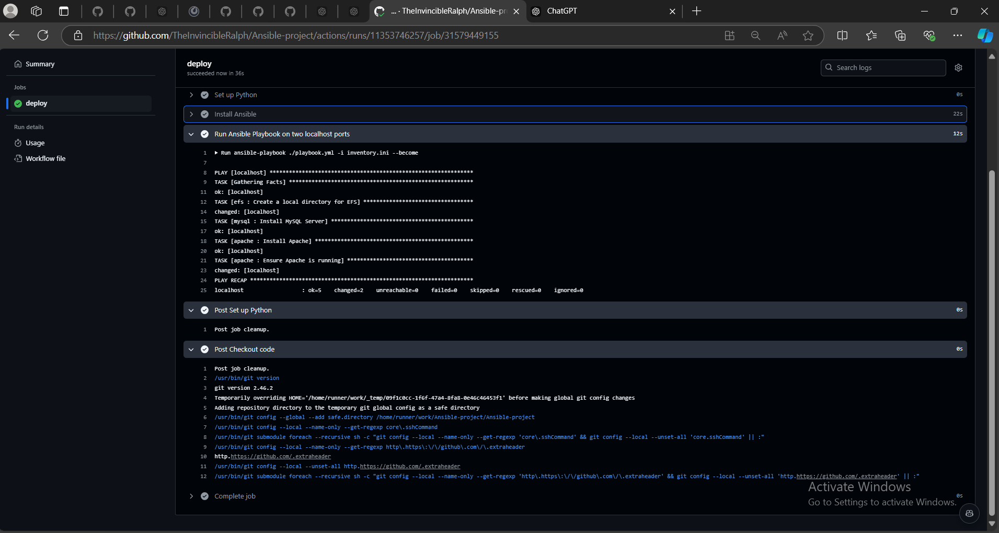

# Automated Deployment of Ansible Playbooks using GitHub Actions

---
> *As a DevOps engineer, you are tasked with automating the deployment of Ansible playbooks for provisioning and configuring infrastructure components on AWS. The goal is to leverage GitHub Actions to trigger the execution of Ansible playbooks whenever changes are pushed to the repository containing the infrastructure code. The automation should cover the provisioning of EC2 instances, setup of EFS file system, installation of MySQL and Apache servers, and mounting of the EFS on the instances.*
---

## Solution Workflow

- Set up a GitHub repository to store Ansible playbooks and related infrastructure code.
- Configure GitHub Actions workflows to automatically trigger Ansible playbooks deployment upon changes to the repository.
- Develop Ansible playbooks to provision **EC2 instances**, create an **EFS file system**, install **MySQL and Apache servers**, and **mount the EFS on the instances**.
- Ensure that all deployment steps are automated and require no manual intervention.
- Integrate GitHub Actions with AWS credentials securely to perform the deployment tasks.
- Implement error handling and notifications in the GitHub Actions workflows to alert on deployment failures.

---

### Setting up GitHub reposirory

```git
echo "# Ansible-practice" >> README.md
git init
git add README.md
git commit -m "first commit"
git branch -M master
git remote add origin https://github.com/TheInvincibleRalph/Ansible-project.git
git push -u origin master
```
---

### GitHub Action Configuration

```yml
# .github/workflows/deploy.yml

name: Deploy Ansible Playbooks

on:
  push:
    branches:
      - master

jobs:
  deploy:
    runs-on: ubuntu-latest
    steps:
      - name: Checkout code
        uses: actions/checkout@v3

      - name: Set up Python
        uses: actions/setup-python@v2
        with:
          python-version: '3.8'

      - name: Install Ansible
        run: |
          python -m pip install --upgrade pip
          pip install ansible

      - name: Run Ansible Playbook on two localhost ports
        run: |
          ansible-playbook ./playbook.yml -i inventory.ini --become
```
---

### Ansible Playbook

**Repository structure:**
```git
ansible-project/
├── roles/
│   ├── efs/
│   │   ├── tasks/
│   │   │   └── main.yml
│   ├── mysql/
│   │   ├── tasks/
│   │   │   └── main.yml
│   └── apache/
│       ├── tasks/
│       │   └── main.yml
```



[Source code](https://github.com/TheInvincibleRalph/Ansible-project)