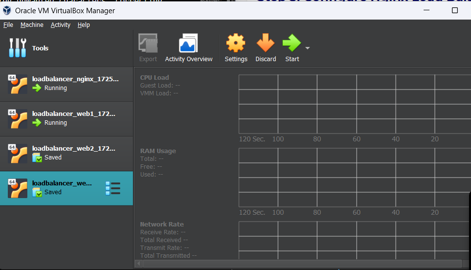
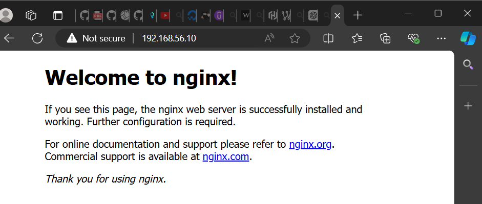

# Provisioning Multiple Vagrant Servers with an Nginx Load Balancer

```bash
PS C:\Users\HP\Desktop\loadbalancer> vagrant up
Bringing machine 'nginx' up with 'virtualbox' provider...
Bringing machine 'web1' up with 'virtualbox' provider...
Bringing machine 'web2' up with 'virtualbox' provider...
Bringing machine 'web3' up with 'virtualbox' provider...
==> nginx: Checking if box 'bento/ubuntu-22.04' version '202407.23.0' is up to date...
==> nginx: Clearing any previously set forwarded ports...
==> nginx: Clearing any previously set network interfaces...
==> nginx: Preparing network interfaces based on configuration...
    nginx: Adapter 1: nat
    nginx: Adapter 2: hostonly
==> nginx: Forwarding ports...
    nginx: 80 (guest) => 8000 (host) (adapter 1)
    nginx: 22 (guest) => 2222 (host) (adapter 1)
==> nginx: Running 'pre-boot' VM customizations...
==> nginx: Booting VM...
==> nginx: Waiting for machine to boot. This may take a few minutes...
    nginx: SSH address: 127.0.0.1:2222
    nginx: SSH username: vagrant
    nginx: SSH auth method: private key
    nginx: Warning: Connection reset. Retrying...
    nginx: Warning: Connection aborted. Retrying...
    nginx: Warning: Connection reset. Retrying...
    nginx: Warning: Connection aborted. Retrying...
    nginx: Warning: Remote connection disconnect. Retrying...
==> nginx: Machine booted and ready!
==> nginx: Checking for guest additions in VM...
==> nginx: Configuring and enabling network interfaces...
==> nginx: Mounting shared folders...
    nginx: /vagrant => C:/Users/HP/Desktop/loadbalancer
==> nginx: Machine already provisioned. Run `vagrant provision` or use the `--provision`
==> nginx: flag to force provisioning. Provisioners marked to run always will still run.
==> web1: Checking if box 'bento/ubuntu-22.04' version '202407.23.0' is up to date...
==> web1: Clearing any previously set forwarded ports...
==> web1: Fixed port collision for 22 => 2222. Now on port 2200.
==> web1: Clearing any previously set network interfaces...
==> web1: Preparing network interfaces based on configuration...
    web1: Adapter 1: nat
    web1: Adapter 2: hostonly
==> web1: Forwarding ports...
    web1: 22 (guest) => 2200 (host) (adapter 1)
==> web1: Running 'pre-boot' VM customizations...
==> web1: Booting VM...
==> web1: Waiting for machine to boot. This may take a few minutes...
    web1: SSH address: 127.0.0.1:2200
    web1: SSH username: vagrant
    web1: SSH auth method: private key
    web1: Warning: Connection reset. Retrying...
    web1: Warning: Connection aborted. Retrying...
    web1: Warning: Connection reset. Retrying...
    web1: Warning: Connection aborted. Retrying...
==> web1: Machine booted and ready!
==> web1: Checking for guest additions in VM...
==> web1: Configuring and enabling network interfaces...
==> web1: Mounting shared folders...
    web1: /vagrant => C:/Users/HP/Desktop/loadbalancer
==> web1: Machine already provisioned. Run `vagrant provision` or use the `--provision`
==> web1: flag to force provisioning. Provisioners marked to run always will still run.
==> web2: Checking if box 'bento/ubuntu-22.04' version '202407.23.0' is up to date...
==> web2: Clearing any previously set forwarded ports...
==> web2: Fixed port collision for 22 => 2222. Now on port 2201.
==> web2: Clearing any previously set network interfaces...
==> web2: Preparing network interfaces based on configuration...
    web2: Adapter 1: nat
    web2: Adapter 2: hostonly
==> web2: Forwarding ports...
    web2: 22 (guest) => 2201 (host) (adapter 1)
==> web2: Running 'pre-boot' VM customizations...
==> web2: Booting VM...
==> web2: Waiting for machine to boot. This may take a few minutes...
    web2: SSH address: 127.0.0.1:2201
    web2: SSH username: vagrant
    web2: SSH auth method: private key
    web2: Warning: Connection reset. Retrying...
    web2: Warning: Connection aborted. Retrying...
    web2: Warning: Connection reset. Retrying...
==> web2: Machine booted and ready!
==> web2: Checking for guest additions in VM...
==> web2: Configuring and enabling network interfaces...
==> web2: Mounting shared folders...
    web2: /vagrant => C:/Users/HP/Desktop/loadbalancer
==> web2: Machine already provisioned. Run `vagrant provision` or use the `--provision`
==> web2: flag to force provisioning. Provisioners marked to run always will still run.
==> web3: Checking if box 'bento/ubuntu-22.04' version '202407.23.0' is up to date...
==> web3: Clearing any previously set forwarded ports...
==> web3: Fixed port collision for 22 => 2222. Now on port 2202.
==> web3: Clearing any previously set network interfaces...
==> web3: Preparing network interfaces based on configuration...
    web3: Adapter 1: nat
    web3: Adapter 2: hostonly
==> web3: Forwarding ports...
    web3: 22 (guest) => 2202 (host) (adapter 1)
==> web3: Running 'pre-boot' VM customizations...
==> web3: Booting VM...
==> web3: Waiting for machine to boot. This may take a few minutes...
    web3: SSH address: 127.0.0.1:2202
    web3: SSH username: vagrant
    web3: SSH auth method: private key
    web3: Warning: Connection reset. Retrying...
    web3: Warning: Connection aborted. Retrying...
    web3: Warning: Connection reset. Retrying...
==> web3: Machine booted and ready!
==> web3: Checking for guest additions in VM...
==> web3: Configuring and enabling network interfaces...
==> web3: Mounting shared folders...
    web3: /vagrant => C:/Users/HP/Desktop/loadbalancer
==> web3: Machine already provisioned. Run `vagrant provision` or use the `--provision`
==> web3: flag to force provisioning. Provisioners marked to run always will still run.
PS C:\Users\HP\Desktop\loadbalancer> vagrant ssh nginx
Welcome to Ubuntu 22.04.4 LTS (GNU/Linux 5.15.0-116-generic x86_64)

 * Documentation:  https://help.ubuntu.com
 * Management:     https://landscape.canonical.com
 * Support:        https://ubuntu.com/pro

 System information as of Wed Sep  4 09:51:32 PM UTC 2024

  System load:  0.01               Processes:             165
  Usage of /:   13.1% of 30.34GB   Users logged in:       0
  Memory usage: 25%                IPv4 address for eth0: 10.0.2.15
  Swap usage:   0%


This system is built by the Bento project by Chef Software
More information can be found at https://github.com/chef/bento

Use of this system is acceptance of the OS vendor EULA and License Agreements.
Last login: Wed Sep  4 21:14:04 2024 from 10.0.2.2
vagrant@vagrant:~$ sudo nano /etc/nginx/sites-available/default
vagrant@vagrant:~$
```

## Outputs


---


---

# Troubleshooting

## 1. Error Type: `Conflicting DHCPs Servers`

After configuring my Vagrantfile, I encountered an error:

```bash
==> nginx: Clearing any previously set network interfaces...
A host only network interface you're attempting to configure via DHCP
already has a conflicting host only adapter with DHCP enabled. The
DHCP on this adapter is incompatible with the DHCP settings. Two
host only network interfaces are not allowed to overlap, and each
host only network interface can have only one DHCP server. Please
reconfigure your host only network or remove the virtual machine
using the other host only network.
```

### Understanding the error:

**What is a Host-Only Network?**
- A host-only network is a type of network connection that VirtualBox creates to allow communication between your host machine (the computer running VirtualBox) and virtual machines (VMs) running on VirtualBox, without allowing the VMs to directly access the wider internet.
- Each host-only network has its own network adapter, and VirtualBox assigns IP addresses within a specific range to these adapters. A DHCP server can also be configured to assign IP addresses automatically to devices connected to this network.

### Possible causes of error:

- Multiple host-only networks can exist due to different Vagrant projects, manually configured setups, or leftover configurations from past VMs.
- Conflicts occur when more than one host-only network has DHCP enabled or when their IP ranges overlap.
- Use the VirtualBox Host Network Manager to view, adjust, or remove these host-only networks to resolve DHCP conflicts.

### How I solved the error:

In my Vagrantfile, instead of using DHCP, I set the network configuration to a static IP replacing this:
```vagrantfile
config.vm.network "private_network", type: "dhcp"
```

with this:

```vagrantfile
config.vm.network "private_network", ip: "192.168.56.10"
```

An alternative solution would be to manage the network configuration via VirtualBox:

1. **Open VirtualBox**:
   - Launch the VirtualBox application on your host machine.

2. **Access Host Network Manager**:
   - In VirtualBox, go to the menu: `File` > `Host Network Manager`.
   - This will show you a list of all host-only network adapters configured in VirtualBox.

3. **Review Network Adapters**:
   - Each adapter will have an associated name like `vboxnet0`, `vboxnet1`, etc.
   - Review the IP address range and DHCP settings for each adapter.

4. **Identify Conflicting DHCP Servers**:
   - Check if multiple adapters have DHCP enabled. If so, there might be a conflict, especially if their IP ranges overlap or if Vagrant tries to use an adapter that already has a DHCP server running.

5. **Resolve Conflicts**:
   - You can either disable the DHCP server on one of the conflicting host-only networks or delete an unnecessary host-only network adapter to avoid conflicts.
   - To disable DHCP, select the adapter and uncheck the "DHCP Server" option.
   - To delete a network, select the adapter and click the "Remove" button.

> To further avoid DHCP conflicts in the Vagrant configuration, I assigned static IP addresses to all the virtual machines instead of relying on DHCP.

---
## 2. Localhost compatibility

To make the loadbalancer (nginx) and the webservers accessible via localhost, I configured the Vagrantfile to forward ports from the virtual machines to my host machine. 

```ruby
Vagrant.configure("2") do |config|
  # Nginx Load Balancer VM
  config.vm.define "nginx" do |nginx|
    nginx.vm.box = "ubuntu/bionic64"
    nginx.vm.network "private_network", type: "dhcp"
    nginx.vm.network "forwarded_port", guest: 80, host: 8080 # port forwarding
    nginx.vm.provision "shell", path: "provision/nginx.sh"
  end
  ```

  Forwarded Port: The `nginx.vm.network "forwarded_port", guest: 80, host: 8080` line forwards port `80` on the Nginx VM to port `8080` on my local machine.

---

## 3. Error Type: `Timeout`

  ```bash
Timed out while waiting for the machine to boot. This means that
Vagrant was unable to communicate with the guest machine within
the configured ("config.vm.boot_timeout" value) time period.

If you look above, you should be able to see the error(s) that
Vagrant had when attempting to connect to the machine. These errors
are usually good hints as to what may be wrong.

If you're using a custom box, make sure that networking is properly
working and you're able to connect to the machine. It is a common
problem that networking isn't setup properly in these boxes.
Verify that authentication configurations are also setup properly,
as well.

If the box appears to be booting properly, you may want to increase
the timeout ("config.vm.boot_timeout") value.
  ```

## Understanding the error:

The `Timed out while waiting for the machine to boot` error typically occurs when Vagrant is unable to establish a connection with the virtual machine within the allotted time. This can be due to various reasons, such as slow VM startup, networking issues, or resource limitations on your host machine.

## Possible causes of error:

  The issue of `web1` taking too long to boot can stem from various factors. Here are some possible reasons and suggestions to troubleshoot and resolve the issue:

### 1. **Network Configuration**:
   - **IP Conflicts**: The IP `192.168.56.11` might be conflicting with another device. The solution to this is to try changing the IP address to something else within the same subnet or use DHCP instead.

### 2. **Resource Allocation**:
   - **Memory and CPU**: Insufficient memory or CPU resources on the host machine can slow down the boot process, especially if multiple VMs are running.

### 3. **Provisioning Issues**:
   - **Slow Package Installation**: The `apt-get update` and `apt-get install -y nginx` commands might be slow due to network issues.


## How I solved the error:

I increased the memory allocated to the VMs:

```ruby
config.vm.provider "virtualbox" do |vb|
  vb.memory = "1024"  # Increase memory allocation to 1 GB
  vb.cpus = 4         # Assign 4 CPUs
end
```

## Scripts

- [The final Vagrantfile can be found here](https://github.com/TheInvincibleRalph/Pistis-DevOps/blob/master/Networking/Vagrantfile)
- Provisioning scripts:
   - [nginx](https://github.com/TheInvincibleRalph/Pistis-DevOps/blob/master/Networking/nginx.sh)
   - [webservers](https://github.com/TheInvincibleRalph/Pistis-DevOps/blob/master/Networking/webserver.sh)